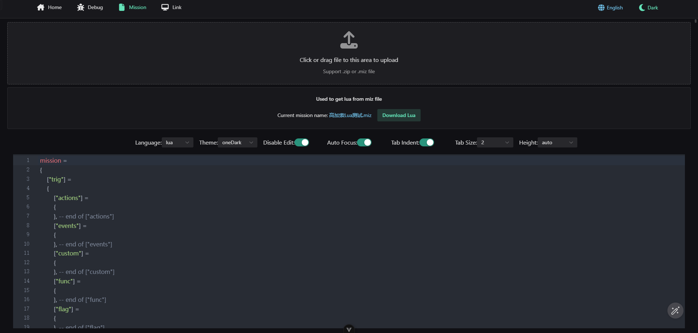

# DCS World Debugger

[简体中文](README.EN) | English

A Node.js-based Lua script debugger for DCS World





## Environment Setup

Node.js version must be 22 or higher

```bash
 "node": ">= 22.0.0"
```

[Node.js Download Link](https://nodejs.org/en/download/package-manager)

Install pnpm globally

```bash
# Only need to install once
npm i -g pnpm

pnpm setup
```

## Usage

1. 🛰️ Get the project code

   ```bash
   git clone https://github.com/zzjtnb/DCS-World-Debugger.git
   ```

2. 🛠️ Install dependencies

   ```bash
   cd DCS-World-Debugger
   pnpm i
   ```

3. 🚀 Run

   ```bash
   pnpm dev
   ```

   You can also simply double-click `RUN SERVER.bat`

4. 🗂️ Move Lua scripts

   Move the `Scripts` folder inside the DCS directory to `C:/Users/{Username}/Saved Games/` (quick command `%HOMEPATH%/Saved Games`) under the folder for the version of DCS World you are running, typically `DCS` or `DCS.openbeta`

   - `%HOMEPATH%/Saved Games/DCS/Scripts`
   - `%HOMEPATH%/Saved Games/DCS.openbeta/Scripts`

5. 🛩️ Run DCS World

Finally, open your browser to [http://localhost:3000](http://localhost:3000) and start debugging 😎

## Configuration

`packages\server\.env` configures the Node.js server and the port for receiving client messages

`Scripts/Debug/config.lua` configures the Lua Socket server and client port numbers

## Check for Port Occupation

```bash
netstat -ano|findstr "9000"
# TCP    127.0.0.1:9000         0.0.0.0:0              LISTENING       8404
taskkill -PID 8404 -F
```

## License

[MIT](./LICENSE) License &copy; 2022 [争逐](https://zzjtnb.com)
