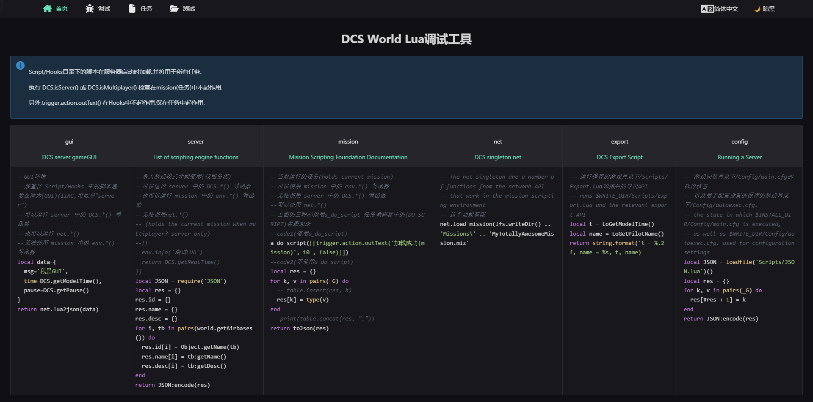
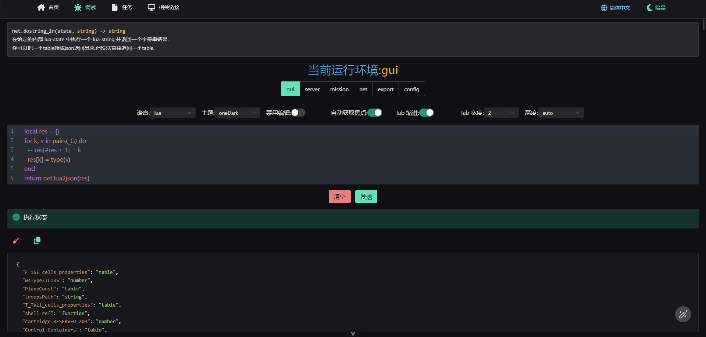
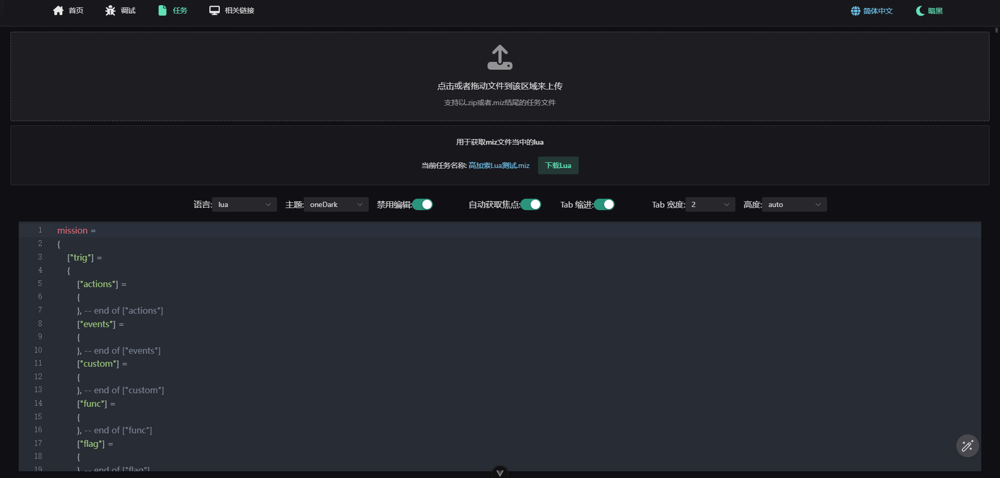
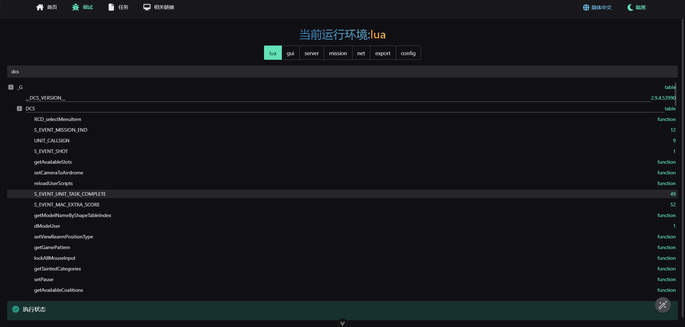

# Depurador DCS World

简体中文 | [English](README.EN.md)

Un depurador de scripts Lua para DCS World basado en Node.js






## Configuración del entorno

Se requiere Node.js versión 22 o superior

```bash
 "node": ">= 22.0.0"
```

[Enlace para descargar Node.js](https://nodejs.org/en/download/package-manager)

Instalar pnpm globalmente

```bash
# Solo se necesita instalar una vez
npm i -g pnpm

pnpm setup
```

## Uso

1. 🛰️ Obtener el código del proyecto

   ```bash
   git cline https://github.com/zzjtnb/DCS-World-Debugger.git
   ```

2. 🛠️ Instalar dependencias

   ```bash
   cd DCS-World-Debugger
   pnpm i
   ```

3. 🚀 Ejecutar

   ```bash
   pnpm dev
   ```

   También puedes hacer doble clic en `RUN.bat`

4. 🗂️ Mover scripts Lua

   Mover la carpeta Scripts del directorio del proyecto dentro de DCS a `C:/Users/{Username}/Saved Games/` (comando rápido `%HOMEPATH%/Saved Games`) en la carpeta de DCS que estés ejecutando (dependiendo de la versión de DCS World que uses). Por defecto `DCS` o `DCS.openbeta`

   - `%HOMEPATH%/Saved Games/DCS/Scripts`
   - `%HOMEPATH%/Saved Games/DCS.openbeta/Scripts`

5. 🛩️ Ejecutar DCS World

Finalmente, abre tu navegador en [http://localhost:3000](http://localhost:3000) para comenzar a escribir tus BUGs 😎

## Configuración relacionada

`packages\\server\\.env` configura el servidor de Node.js y el puerto donde recibe clientes

`Scripts/Debug/config.lua` configura el puerto del servidor de Lua Socket y el cliente que envía datos

号

## Buscar puertos en uso

```bash
netstat -ano|findstr "9000"
# TCP    127.0.0.1:9000         0.0.0.0:0              LISTENING       8404
taskkill -PID 8404 -F
```

## Licencia

[MIT](./LICENSE) License &copy; 2022 [争逐](https://zzjtnb.com)
