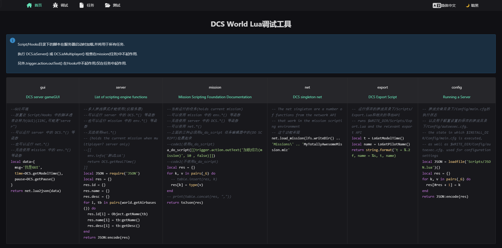
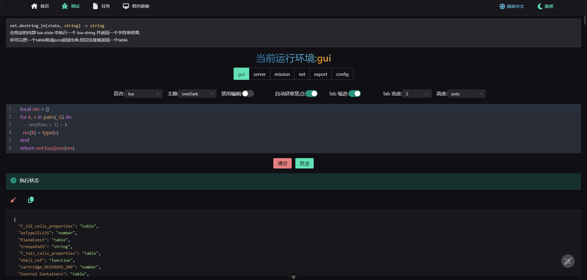
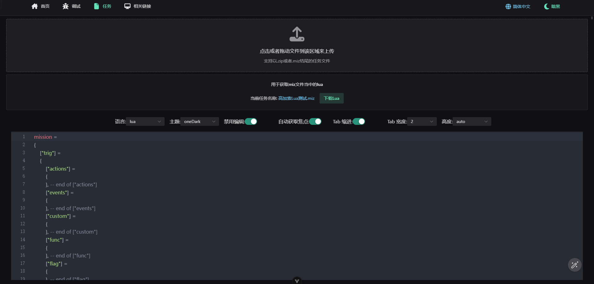
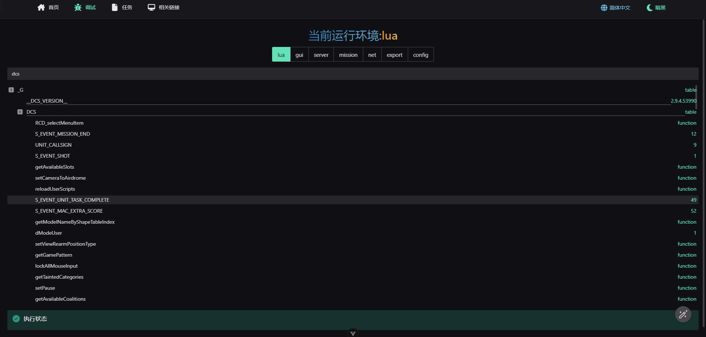

# DCS World Debugger

简体中文 | [English](README.EN.md)

一个基于Node.js的DCS World Lua 脚本调试器






## 环境配置

Node.js 版本要求必须大于等于 22

```bash
 "node": ">= 22.0.0"
```

[Node.js下载链接](https://nodejs.org/en/download/package-manager)

全局安装pnpm

```bash
# 仅需安装一次
npm i -g pnpm

pnpm setup
```

## 使用

1. 🛰️ 获取项目代码

   ```bash
   git cline https://github.com/zzjtnb/DCS-World-Debugger.git
   ```

2. 🛠️ 安装依赖

   ```bash
   cd DCS-World-Debugger
   pnpm i
   ```

3. 🚀 运行

   ```bash
   pnpm dev
   ```

   你也可以直接双击`RUN.bat`

4. 🗂️ 移动Lua 脚本

   移动项目目录下的 DCS 里面的 Scripts 文件夹到`C:/Users\{Username}/Saved Games/`(快捷命令`%HOMEPATH%/Saved Games`)下的你所运行的 DCS 文件夹(取决于你所运行的的 DCS World), 默认`DCS 或者 DCS.openbeta`

   - `%HOMEPATH%/Saved Games/DCS/Scripts`
   - `%HOMEPATH%/Saved Games/DCS.openbeta/Scripts`

5. 🛩️ 运行 DCS World

最后浏览器打开 [http://localhost:3000](http://localhost:3000) 开始写你的 BUG 😎

## 相关配置

`packages\server\.env` 配置 Node.js 的服务器和接收客户端发送的端口

`Scripts/Debug/config.lua` 配置 Lua Socket 的服务器接收和客户端发送的端口号

号

## 查找端口占用

```bash
netstat -ano|findstr "9000"
# TCP    127.0.0.1:9000         0.0.0.0:0              LISTENING       8404
taskkill -PID 8404 -F
```

## License

[MIT](./LICENSE) License &copy; 2022 [争逐](https://zzjtnb.com)
