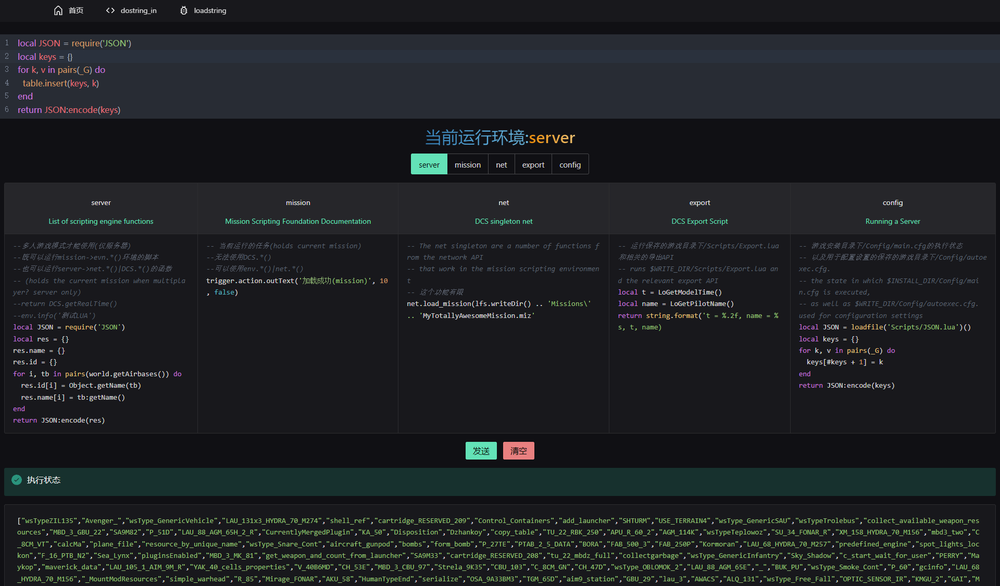

# This is a DCS World Lua script debugger based on Node.js



## Frist

move DCS/Scripts/Hooks,DCS/Scripts/statistics folder: (depending on the DCS World version you have installed..)

- `%USERPROFILE%/Saved Games/DCS.openbeta/Scripts`
- `%USERPROFILE%/Saved Games/DCS/Scripts`

or if you have both, choose one or both DCS versions to install script;

## Second step

**Install nodejs**
[Node.js下载链接](https://nodejs.org/zh-cn/)|[Node.js Download link](https://nodejs.org/en/)

_Skip if already installed Nodejs_

## third step

double-click RUN SERVER.bat or cmd into the current directory execute the following command

```bash
npm  -g i pnpm
pnpm i
pnpm dev
```

## fourth step

Run Your DCS World Server

_Note: The third and fourth steps are not fixed in order_

Finally the browser open [http://localhost:3000](http://localhost:3000) start enjoying

```bash
netstat -ano|findstr "6666"
# TCP    127.0.0.1:6666         0.0.0.0:0              LISTENING       8404
taskkill -PID 8404 -F
```

## License

[MIT](./LICENSE) License &copy; 2022 [争逐](https://zzjtnb.com)
